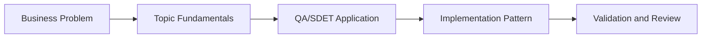

# MCP Basics for QA: Learning Guide

## What We Are Learning

Model Context Protocol basics for QA workflows, browser orchestration, and tool-assisted test execution.

### Learning Goals
- Understand what MCP is and why it matters for AI-driven QA workflows.
- Learn how tools such as Playwright and JIRA can be exposed safely to an AI workflow.
- Recognize the boundaries between agent reasoning, tool invocation, and human approval.
- Map MCP concepts to real QA activities such as evidence capture, execution, and bug filing.

### Core Concepts
- MCP client, server, tool, and resource model
- Safe browser automation with Playwright MCP
- JIRA-style defect creation through structured tool calls
- Auditability, permissions, and reproducibility in AI-assisted QA

## QA/SDET Lens

- Focus on how this topic improves test design, reliability, coverage, or release confidence.
- Look for where AI should assist, where human review is mandatory, and how to measure trust.
- Tie every concept back to a concrete QA artifact such as a test case, report, dashboard, or pipeline gate.

## Concept Flow

## Suggested Study Sequence

1. Read the parent project README for the full project goal.
2. Learn the core concepts in this folder.
3. Try the exercises in `02_Exercises`.
4. Review the interview questions in `03_Interview_Questions`.
5. Return to the project implementation and map the concepts to code and deliverables.
