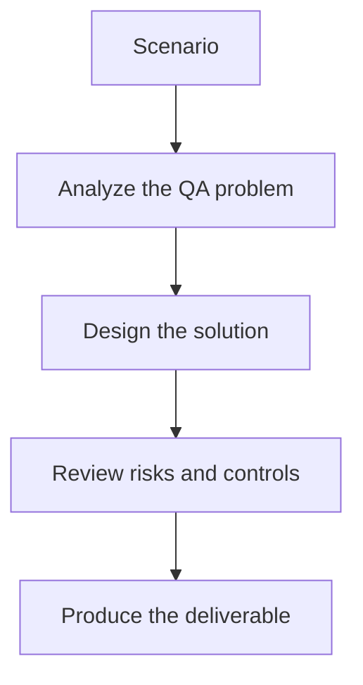

# Exercise 01: Design an MCP-Driven Login Test Workflow

## Objective

Map a simple QA automation scenario into MCP tools, approvals, and evidence artifacts.

## Scenario

A tester wants an AI assistant to execute a login smoke test, capture failures, and prepare a defect draft.

## Tasks

1. Identify the MCP tools needed for browser actions, screenshot capture, and issue creation.
2. Define which actions can be autonomous and which require human approval.
3. Describe the minimum evidence that should be attached to a failed run.
4. Explain how the workflow remains auditable for a QA lead.

## QA Checkpoints

- Tool boundaries are explicit.
- Human approval points are justified.
- Evidence artifacts are complete and reusable.
- The workflow remains auditable end to end.

## Suggested Flow

## Expected Deliverable

A one-page MCP workflow diagram with tool boundaries and approval checkpoints.
