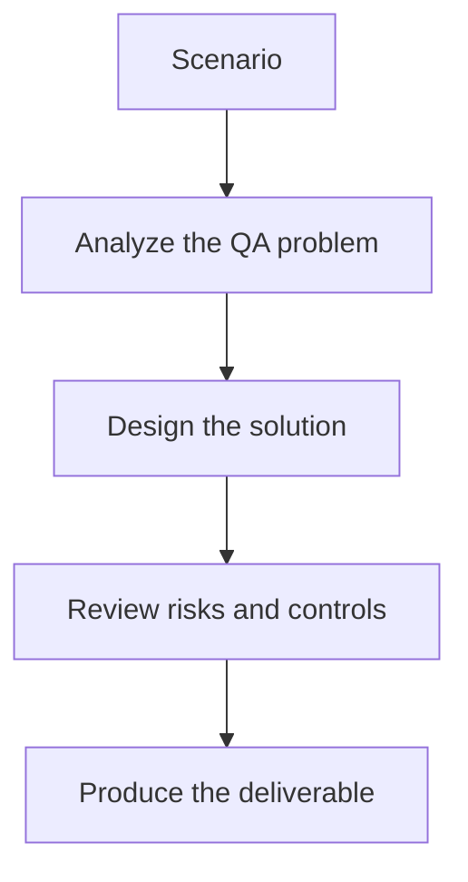

# Exercise 02: Create a Tool Contract for Bug Filing

## Objective

Translate a QA defect workflow into a structured MCP-style tool contract.

## Scenario

Your AI workflow must create a bug only when a failure is reproducible and supported by evidence.

## Tasks

1. Define the required input fields for the bug-creation tool.
2. List validation rules that prevent low-quality or duplicate issues.
3. Specify how screenshots, logs, and repro steps are packaged.
4. Add one guardrail that prevents the AI from filing a bad ticket automatically.

## QA Checkpoints

- Tool boundaries are explicit.
- Human approval points are justified.
- Evidence artifacts are complete and reusable.
- The workflow remains auditable end to end.

## Suggested Flow

## Expected Deliverable

A markdown tool contract showing inputs, outputs, validation, and guardrails.
