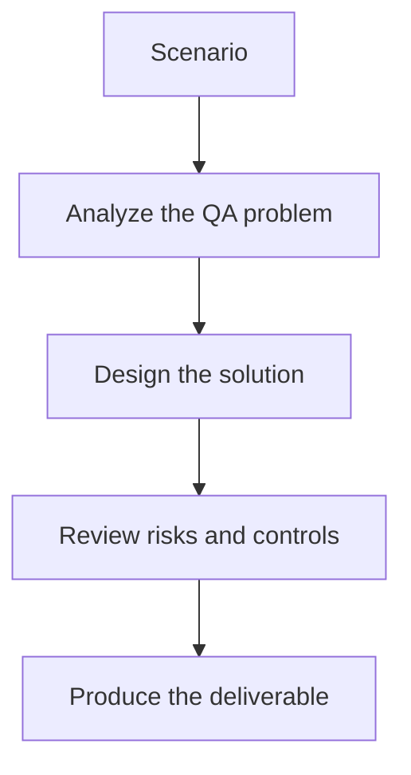

# Exercise 03: Review Safety and Observability for MCP QA Workflows

## Objective

Evaluate the risks of giving an AI system tool access in a QA environment.

## Scenario

Your team wants to expand MCP support from test execution to environment cleanup and Jira updates.

## Tasks

1. List the top safety risks of broadening the workflow scope.
2. Propose role-based permission boundaries for test, bug, and environment tools.
3. Define the logs needed to reconstruct a full run after an incident.
4. Recommend a rollout plan from sandbox testing to production use.

## QA Checkpoints

- Tool boundaries are explicit.
- Human approval points are justified.
- Evidence artifacts are complete and reusable.
- The workflow remains auditable end to end.

## Suggested Flow

## Expected Deliverable

A risk review note with controls, observability signals, and rollout phases.
