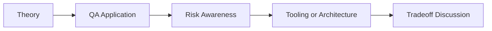

# MCP Basics for QA: QA/SDET Interview Questions

## How to Use This Folder

These questions are designed for QA engineers, SDETs, and AI-focused testing roles. Use them for self-review, mock interviews, or classroom discussion.

### Interview Questions
1. What problem does MCP solve for QA teams using AI-assisted tooling?
2. How would you prevent an AI agent from taking unsafe browser or issue-tracker actions through MCP?
3. What is the difference between a tool call and a resource lookup in an MCP-style workflow?
4. How would you test an MCP server that exposes Playwright actions to an AI system?
5. Why is auditability important in AI-assisted QA execution platforms?
6. How would you explain MCP to an SDET who has worked only with APIs and browser automation?

## Competency Map

## Strong Answer Signals

- clear explanation of the underlying concept
- strong QA framing, not just generic AI wording
- awareness of failure modes, limits, and review practices
- ability to connect tools to delivery impact and maintainability

## Discussion Guide

After you attempt the questions on your own, review the expected discussion points here:

- [answers.md](./answers.md)
