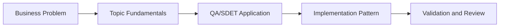

# AI + Test Frameworks: Learning Guide

## What We Are Learning

Using AI to design, scaffold, review, and improve automation frameworks for Selenium, Playwright, API, and mobile testing.

### Learning Goals
- Identify where AI accelerates framework bootstrapping without replacing framework design judgment.
- Learn how to prompt for maintainable abstractions such as page objects, fixtures, helpers, and API clients.
- Review AI-generated automation code for quality, reuse, and long-term maintainability.
- Connect framework design choices to team scale, product complexity, and execution reliability.

### Core Concepts
- Framework layering: tests, fixtures, pages, utilities, config
- Prompt patterns for framework scaffolding and refactoring
- Review heuristics for AI-generated automation code
- Choosing between Selenium, Playwright, API-first, and mobile-first strategies

## QA/SDET Lens

- Focus on how this topic improves test design, reliability, coverage, or release confidence.
- Look for where AI should assist, where human review is mandatory, and how to measure trust.
- Tie every concept back to a concrete QA artifact such as a test case, report, dashboard, or pipeline gate.

## Concept Flow

## Suggested Study Sequence

1. Read the parent project README for the full project goal.
2. Learn the core concepts in this folder.
3. Try the exercises in `02_Exercises`.
4. Review the interview questions in `03_Interview_Questions`.
5. Return to the project implementation and map the concepts to code and deliverables.
