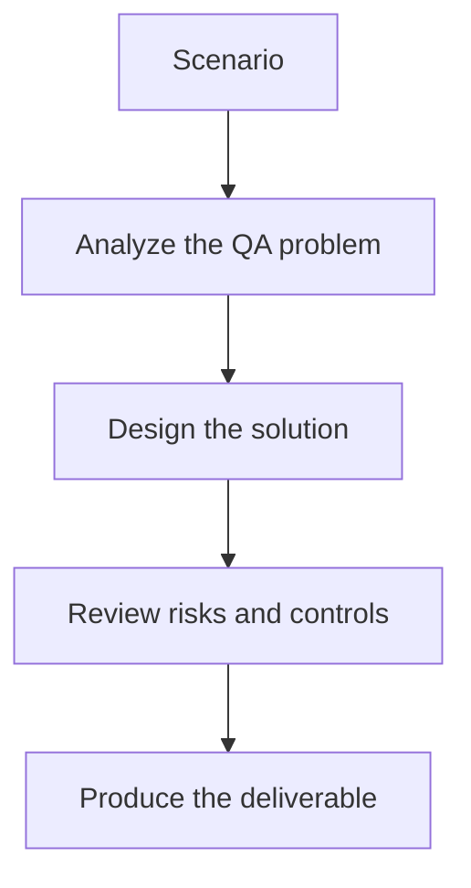

# Exercise 01: Blueprint a Playwright Framework with AI

## Objective

Turn a feature requirement into a framework design that AI can scaffold safely.

## Scenario

Your team needs a new Playwright framework for an e-commerce app with smoke, regression, and API-assisted setup.

## Tasks

1. Define the layers: tests, fixtures, pages, data, config, and utilities.
2. Write a prompt that asks AI to generate only one layer at a time.
3. List the coding standards the generated framework must follow.
4. Explain how you will review the generated code before adoption.

## QA Checkpoints

- Abstractions are reusable, not test-case specific.
- Generated code respects framework standards.
- Synchronization and assertions are robust.
- Humans remain accountable for review and merge quality.

## Suggested Flow

## Expected Deliverable

A framework blueprint plus a controlled AI scaffolding prompt.
