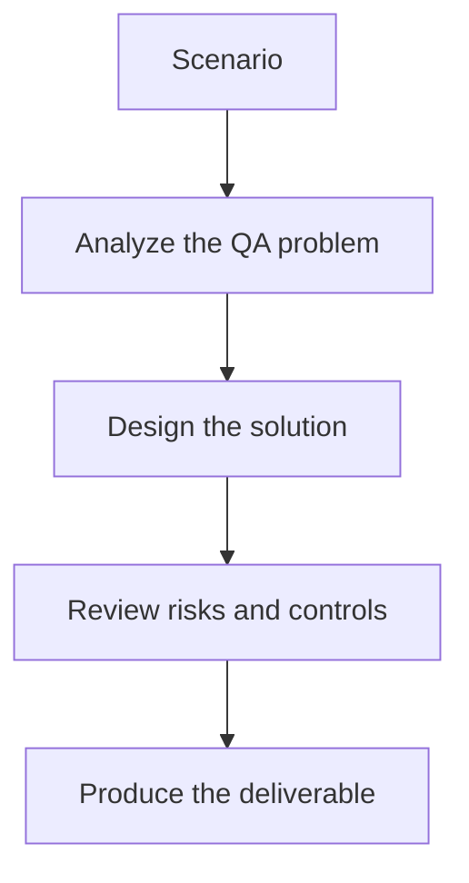

# Exercise 02: Review a Poor AI-Generated Selenium Test

## Objective

Practice identifying maintainability problems in generated automation code.

## Scenario

An AI tool produced a long Selenium test with hard-coded waits, mixed assertions, and duplicate selectors.

## Tasks

1. List the top design smells in the generated test.
2. Refactor the flow into page objects or component helpers.
3. Replace fragile waits with a resilient synchronization strategy.
4. Write review comments that teach the team what to reject next time.

## QA Checkpoints

- Abstractions are reusable, not test-case specific.
- Generated code respects framework standards.
- Synchronization and assertions are robust.
- Humans remain accountable for review and merge quality.

## Suggested Flow

## Expected Deliverable

A review memo with refactoring recommendations and framework rules.
