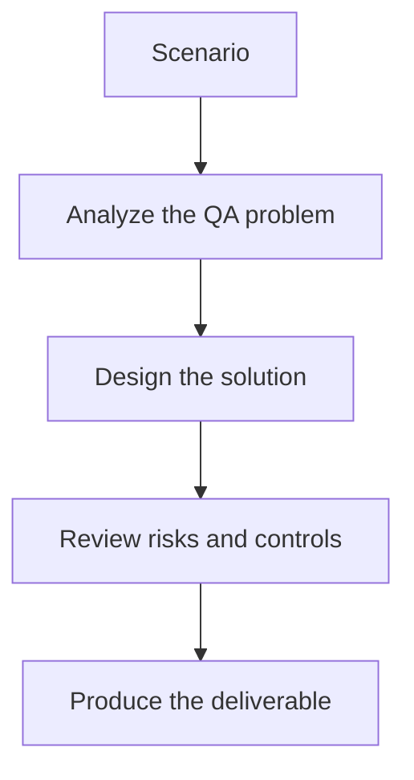

# Exercise 03: Design AI Assistance for API Framework Setup

## Objective

Use AI where it helps API automation without allowing it to invent contract details.

## Scenario

A new service exposes a draft OpenAPI spec, and QA must prepare request models and reusable API clients.

## Tasks

1. List which framework assets can be generated from the spec.
2. Define a validation checklist for AI-generated request and response models.
3. Explain how versioning and schema drift should be handled.
4. Describe when a human must override the generated output.

## QA Checkpoints

- Abstractions are reusable, not test-case specific.
- Generated code respects framework standards.
- Synchronization and assertions are robust.
- Humans remain accountable for review and merge quality.

## Suggested Flow

## Expected Deliverable

An API framework generation strategy with validation checkpoints.
