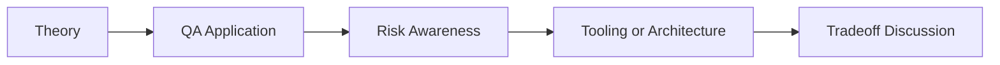

# AI + Test Frameworks: QA/SDET Interview Questions

## How to Use This Folder

These questions are designed for QA engineers, SDETs, and AI-focused testing roles. Use them for self-review, mock interviews, or classroom discussion.

### Interview Questions
1. Where does AI help most when building a test automation framework?
2. What risks appear when teams copy AI-generated framework code without review?
3. How would you evaluate whether a generated Page Object follows good design principles?
4. How can AI assist API framework setup for request models and clients?
5. What QA standards would you enforce before merging AI-generated framework code?
6. How would you compare AI-assisted framework design in Selenium versus Playwright?

## Competency Map

## Strong Answer Signals

- clear explanation of the underlying concept
- strong QA framing, not just generic AI wording
- awareness of failure modes, limits, and review practices
- ability to connect tools to delivery impact and maintainability

## Discussion Guide

After you attempt the questions on your own, review the expected discussion points here:

- [answers.md](./answers.md)
