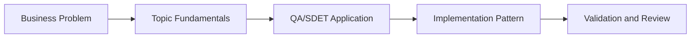

# CI/CD + AI: Learning Guide

## What We Are Learning

Applying AI to pipeline summaries, failure analysis, debugging support, and delivery visibility for QA teams.

### Learning Goals
- Understand where AI adds value in CI/CD without becoming a release decision-maker.
- Learn how to summarize test and build failures into clear QA signals.
- Design AI-assisted debugging steps that remain deterministic and safe.
- Connect pipeline telemetry, artifacts, and AI insights for quicker failure triage.

### Core Concepts
- Pipeline event flow and test-report ingestion
- AI summarization of logs, flaky runs, and deployment failures
- Human-in-the-loop gates for release recommendations
- Jenkins and GitHub Actions integration patterns

## QA/SDET Lens

- Focus on how this topic improves test design, reliability, coverage, or release confidence.
- Look for where AI should assist, where human review is mandatory, and how to measure trust.
- Tie every concept back to a concrete QA artifact such as a test case, report, dashboard, or pipeline gate.

## Concept Flow

## Suggested Study Sequence

1. Read the parent project README for the full project goal.
2. Learn the core concepts in this folder.
3. Try the exercises in `02_Exercises`.
4. Review the interview questions in `03_Interview_Questions`.
5. Return to the project implementation and map the concepts to code and deliverables.
