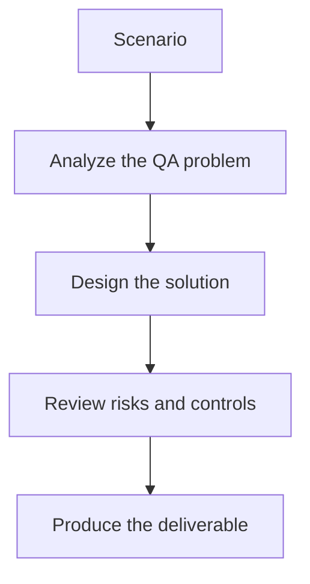

# Exercise 01: Convert a Failed CI Run into a QA Summary

## Objective

Practice turning noisy build output into stakeholder-ready insight.

## Scenario

A nightly regression failed with 2,000 lines of logs, mixed test failures, and infrastructure warnings.

## Tasks

1. Identify the most important signals for QA, engineering, and product audiences.
2. Write a prompt for summarizing the failure without hiding uncertainty.
3. Separate probable test issues from infrastructure noise.
4. Define the fields a summary report must include before being shared.

## QA Checkpoints

- Summaries preserve uncertainty.
- The pipeline remains deterministic and governed.
- AI outputs are clearly labeled as analysis, not authority.
- Key metrics are traceable back to raw artifacts.

## Suggested Flow

## Expected Deliverable

A prompt and report outline for AI-generated CI triage.
