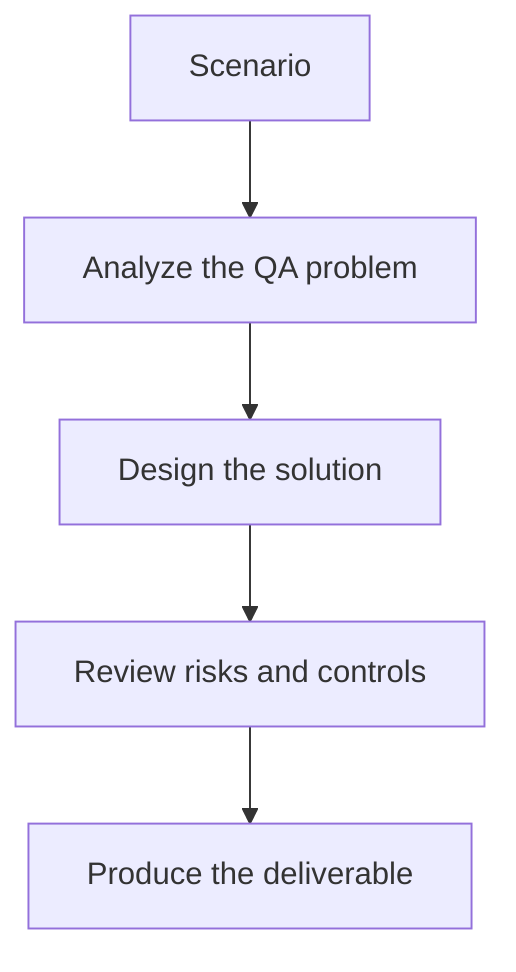

# Exercise 02: Design a Safe AI Debug Step in a Pipeline

## Objective

Add AI-assisted analysis to CI/CD without compromising release safety.

## Scenario

Your team wants an AI step that explains failures and suggests next actions during pull-request validation.

## Tasks

1. Define where the AI step runs in the pipeline.
2. List the inputs that should be provided to the model.
3. State which decisions the AI may suggest but not execute.
4. Describe how you will validate the quality of the suggestions over time.

## QA Checkpoints

- Summaries preserve uncertainty.
- The pipeline remains deterministic and governed.
- AI outputs are clearly labeled as analysis, not authority.
- Key metrics are traceable back to raw artifacts.

## Suggested Flow

## Expected Deliverable

A CI step design with inputs, outputs, limits, and monitoring.
