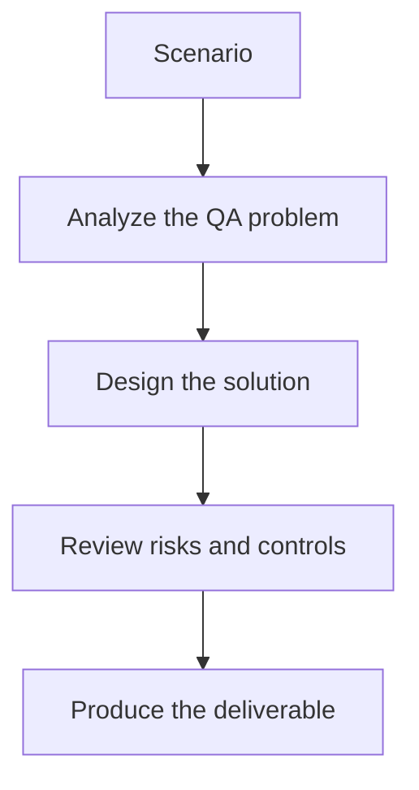

# Exercise 03: Build a Pipeline Signal Dashboard Concept

## Objective

Combine raw CI metrics and AI summaries into a teachable QA dashboard.

## Scenario

Leadership wants a quick way to understand release readiness from recent pipeline runs.

## Tasks

1. List the minimum metrics the dashboard should always show.
2. Decide how AI summaries and failure clusters should be displayed.
3. Define the threshold for surfacing flaky-test patterns.
4. Explain how the dashboard avoids overconfidence from AI-generated text.

## QA Checkpoints

- Summaries preserve uncertainty.
- The pipeline remains deterministic and governed.
- AI outputs are clearly labeled as analysis, not authority.
- Key metrics are traceable back to raw artifacts.

## Suggested Flow

## Expected Deliverable

A dashboard wireframe note with release-readiness signals.
