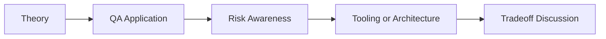

# CI/CD + AI: QA/SDET Interview Questions

## How to Use This Folder

These questions are designed for QA engineers, SDETs, and AI-focused testing roles. Use them for self-review, mock interviews, or classroom discussion.

### Interview Questions
1. Where is AI useful in CI/CD for QA engineers, and where should it not be trusted?
2. How would you summarize a failed regression run for product and engineering stakeholders?
3. What safeguards should exist if AI is used inside a release pipeline?
4. How would you test the quality of AI-generated pipeline summaries?
5. What data sources inside CI/CD provide the strongest signal for AI triage?
6. How would you explain the difference between log summarization and root-cause analysis?

## Competency Map

## Strong Answer Signals

- clear explanation of the underlying concept
- strong QA framing, not just generic AI wording
- awareness of failure modes, limits, and review practices
- ability to connect tools to delivery impact and maintainability

## Discussion Guide

After you attempt the questions on your own, review the expected discussion points here:

- [answers.md](./answers.md)
