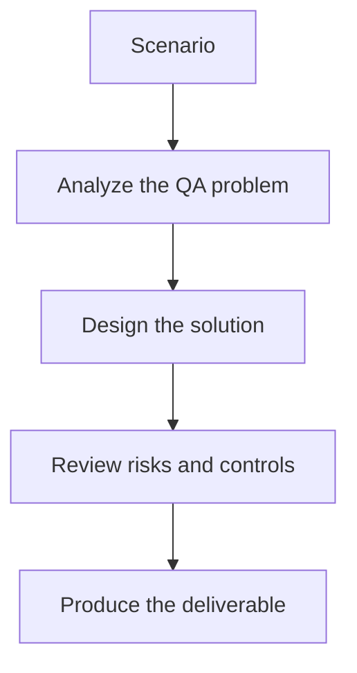

# Exercise 01: Build a Mini Golden Dataset

## Objective

Create a small but useful dataset for evaluating an LLM feature.

## Scenario

A chatbot answers product questions and should return safe, accurate, JSON-formatted summaries.

## Tasks

1. Define five realistic test prompts and expected outcomes.
2. Separate positive, negative, and adversarial examples.
3. Add one case that checks structured output conformance.
4. Explain how you would keep the dataset versioned.

## QA Checkpoints

- Quality dimensions are explicit.
- Datasets include negative and adversarial coverage.
- Pass/fail logic is justified.
- Evaluation noise is acknowledged and controlled.

## Suggested Flow

## Expected Deliverable

A mini evaluation dataset with clear pass criteria.
