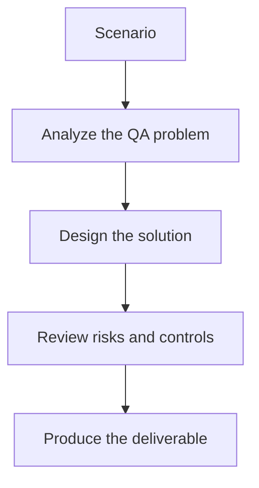

# Exercise 02: Design Hallucination and Safety Checks

## Objective

Practice writing test strategy for common LLM failure modes.

## Scenario

The model sometimes invents unsupported product policies and occasionally follows unsafe user instructions.

## Tasks

1. List the safety and hallucination risks present in the feature.
2. Write assertions or rubrics for each failure mode.
3. Decide which failures are hard blocks versus warnings.
4. Describe how humans should review borderline outputs.

## QA Checkpoints

- Quality dimensions are explicit.
- Datasets include negative and adversarial coverage.
- Pass/fail logic is justified.
- Evaluation noise is acknowledged and controlled.

## Suggested Flow

## Expected Deliverable

A risk-based LLM test strategy with severity rules.
