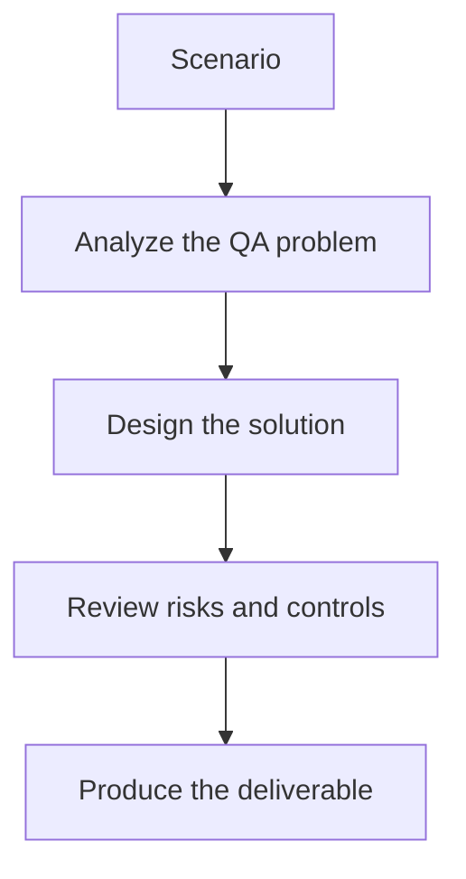

# Exercise 03: Compare Evaluation Methods

## Objective

Understand when to use exact assertions, rubrics, or model-based evaluators.

## Scenario

Your team disagrees about whether a support-answering assistant should be tested with strict string assertions or judge-based scoring.

## Tasks

1. Choose two test cases for deterministic assertions.
2. Choose two test cases for rubric-based scoring.
3. Explain when a model-based evaluator is helpful and risky.
4. Define a combined strategy for CI regression runs.

## QA Checkpoints

- Quality dimensions are explicit.
- Datasets include negative and adversarial coverage.
- Pass/fail logic is justified.
- Evaluation noise is acknowledged and controlled.

## Suggested Flow

## Expected Deliverable

A short comparison note covering evaluation tradeoffs.
