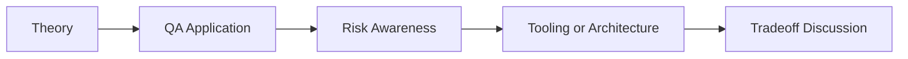

# LLM Testing: QA/SDET Interview Questions

## How to Use This Folder

These questions are designed for QA engineers, SDETs, and AI-focused testing roles. Use them for self-review, mock interviews, or classroom discussion.

### Interview Questions
1. Why is LLM testing different from traditional API or UI testing?
2. How would you measure hallucination risk in a QA-friendly way?
3. What is the difference between deterministic assertions and rubric-based evaluation?
4. How would you validate structured output from an LLM in production?
5. What role does a golden dataset play in LLM regression testing?
6. How would you explain DeepEval or Promptfoo to a QA automation engineer?

## Competency Map

## Strong Answer Signals

- clear explanation of the underlying concept
- strong QA framing, not just generic AI wording
- awareness of failure modes, limits, and review practices
- ability to connect tools to delivery impact and maintainability

## Discussion Guide

After you attempt the questions on your own, review the expected discussion points here:

- [answers.md](./answers.md)
