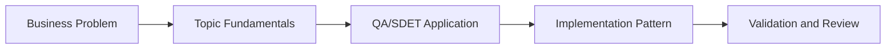

# LangChain Foundations for Testers: Learning Guide

## What We Are Learning

Learning LangChain primitives through test-case generation, agents, tools, memory, and structured QA artifacts.

### Learning Goals
- Understand the LangChain building blocks that matter most to QA workflows.
- Map prompts, models, parsers, tools, and memory to practical testing tasks.
- Build confidence in chaining multiple AI steps into one QA pipeline.
- Recognize how structured outputs make AI artifacts useful in engineering systems.

### Core Concepts
- Prompt templates, runnable chains, and LCEL composition
- Structured output parsers for test cases, plans, and reports
- Agents and tools for QA planning and retrieval
- Memory patterns for iterative QA assistants

## QA/SDET Lens

- Focus on how this topic improves test design, reliability, coverage, or release confidence.
- Look for where AI should assist, where human review is mandatory, and how to measure trust.
- Tie every concept back to a concrete QA artifact such as a test case, report, dashboard, or pipeline gate.

## Concept Flow

## Suggested Study Sequence

1. Read the parent project README for the full project goal.
2. Learn the core concepts in this folder.
3. Try the exercises in `02_Exercises`.
4. Review the interview questions in `03_Interview_Questions`.
5. Return to the project implementation and map the concepts to code and deliverables.
