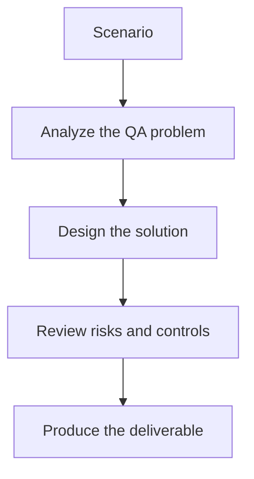

# Exercise 01: Build a User Story to Test Case Chain

## Objective

Practice turning a single QA task into a structured LangChain pipeline.

## Scenario

A product story describes account creation, and QA needs generated test cases with priority, steps, and expected results.

## Tasks

1. Map the prompt, model, and parser needed for the chain.
2. Define the output schema for the generated test cases.
3. List the validation failures that should trigger a retry.
4. Explain why this should be a chain and not an agent.

## QA Checkpoints

- Chains have clear inputs and outputs.
- Tools are justified and testable.
- Memory use is deliberate.
- Structured outputs are validated.

## Suggested Flow

## Expected Deliverable

A chain design with inputs, outputs, and parser rules.
