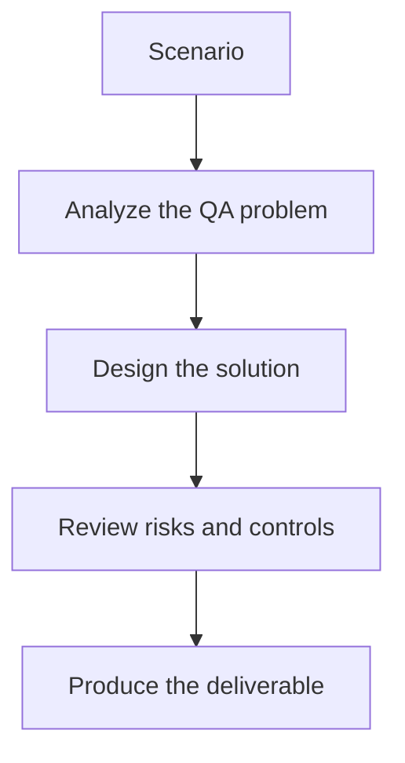

# Exercise 02: Add a QA Tool to an Agent

## Objective

Understand how tools change the behavior of LangChain agents in testing workflows.

## Scenario

Your QA assistant needs to look up known bugs before generating a test plan.

## Tasks

1. Define the tool input and output contract.
2. Explain how the agent decides when to call the tool.
3. List failure cases if the tool returns incomplete or stale data.
4. Describe how you would test the agent-tool interaction.

## QA Checkpoints

- Chains have clear inputs and outputs.
- Tools are justified and testable.
- Memory use is deliberate.
- Structured outputs are validated.

## Suggested Flow

## Expected Deliverable

A tool integration note for a QA planning agent.
