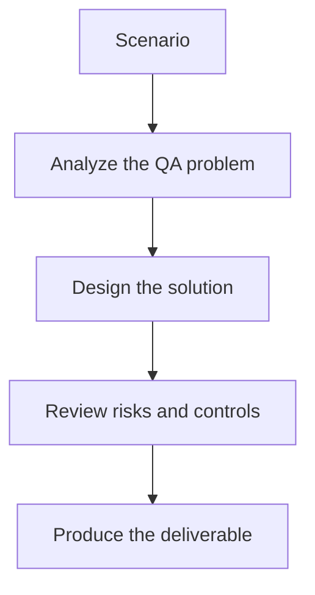

# Exercise 03: Compare Memory and No-Memory QA Assistants

## Objective

Explore when conversation memory improves or harms a QA support flow.

## Scenario

A tester iteratively refines a test plan over several turns and expects the assistant to remember context.

## Tasks

1. Identify what context should be remembered safely.
2. List the risks of stale or misleading memory.
3. Define one conversation where memory helps and one where it harms.
4. Explain how you would reset or summarize context across sessions.

## QA Checkpoints

- Chains have clear inputs and outputs.
- Tools are justified and testable.
- Memory use is deliberate.
- Structured outputs are validated.

## Suggested Flow

## Expected Deliverable

A memory strategy note for a QA assistant.
