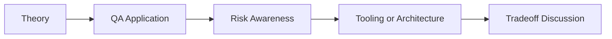

# LangChain Foundations for Testers: QA/SDET Interview Questions

## How to Use This Folder

These questions are designed for QA engineers, SDETs, and AI-focused testing roles. Use them for self-review, mock interviews, or classroom discussion.

### Interview Questions
1. What LangChain concepts are most relevant to QA engineers?
2. When would you use a chain instead of an agent for a QA use case?
3. Why are output parsers important in AI-assisted test generation?
4. How does memory change the behavior of a QA assistant built with LangChain?
5. How would you validate the quality of a LangChain-based test planning workflow?
6. What tradeoffs would you explain between local and cloud models in a LangChain QA app?

## Competency Map

## Strong Answer Signals

- clear explanation of the underlying concept
- strong QA framing, not just generic AI wording
- awareness of failure modes, limits, and review practices
- ability to connect tools to delivery impact and maintainability

## Discussion Guide

After you attempt the questions on your own, review the expected discussion points here:

- [answers.md](./answers.md)
