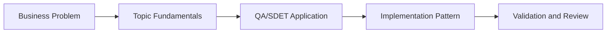

# Graph RAG QA Knowledge Base: Learning Guide

## What We Are Learning

Building knowledge-graph-powered retrieval for impact analysis, traceability, and QA knowledge exploration.

### Learning Goals
- Understand how Graph RAG differs from vector-only retrieval.
- Model QA entities such as features, bugs, test cases, and modules as a graph.
- Learn how multi-hop reasoning helps coverage and impact analysis.
- Connect graph retrieval to practical QA questions such as change impact and missing coverage.

### Core Concepts
- Graph schema design for QA domains
- Entity and relationship extraction from test artifacts
- Cypher query generation and graph traversal
- Hybrid graph plus vector retrieval strategies

## QA/SDET Lens

- Focus on how this topic improves test design, reliability, coverage, or release confidence.
- Look for where AI should assist, where human review is mandatory, and how to measure trust.
- Tie every concept back to a concrete QA artifact such as a test case, report, dashboard, or pipeline gate.

## Concept Flow

## Suggested Study Sequence

1. Read the parent project README for the full project goal.
2. Learn the core concepts in this folder.
3. Try the exercises in `02_Exercises`.
4. Review the interview questions in `03_Interview_Questions`.
5. Return to the project implementation and map the concepts to code and deliverables.
