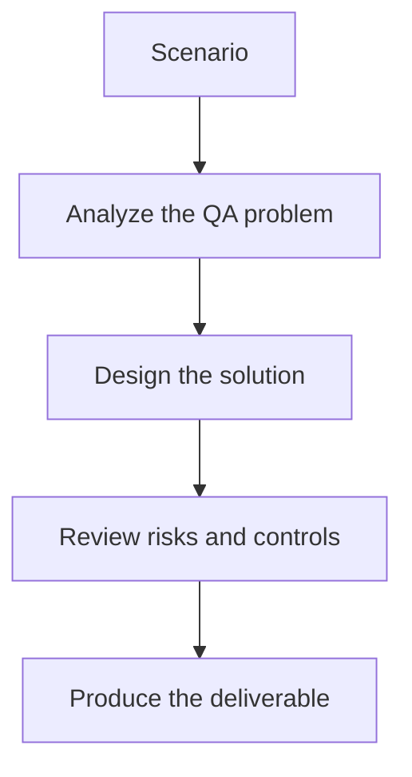

# Exercise 01: Model a QA Domain Graph

## Objective

Design a graph schema for real QA assets and relationships.

## Scenario

Your team wants to connect features, modules, bugs, test cases, and requirements in one queryable graph.

## Tasks

1. List the node types that belong in the graph.
2. Define the most valuable relationships for impact analysis.
3. Choose one property that helps each node remain traceable.
4. Explain how duplicate entities should be resolved during ingestion.

## QA Checkpoints

- Graph entities reflect the QA domain accurately.
- Multi-hop value is explicit.
- Ingestion quality is testable.
- Graph answers remain explainable.

## Suggested Flow

## Expected Deliverable

A graph schema sketch for a QA knowledge base.
