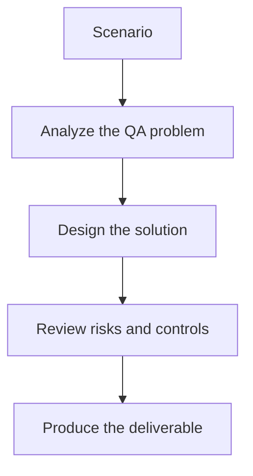

# Exercise 02: Plan a Multi-Hop Query

## Objective

Practice asking graph-native QA questions instead of keyword-only questions.

## Scenario

A module change may affect several test suites through shared dependencies.

## Tasks

1. Write one question that needs two hops through the graph.
2. Write one question that needs both graph and text evidence.
3. Explain why a vector-only system could miss the answer.
4. Describe the output a tester would need from the system.

## QA Checkpoints

- Graph entities reflect the QA domain accurately.
- Multi-hop value is explicit.
- Ingestion quality is testable.
- Graph answers remain explainable.

## Suggested Flow

## Expected Deliverable

A set of graph-native QA queries with expected outputs.
