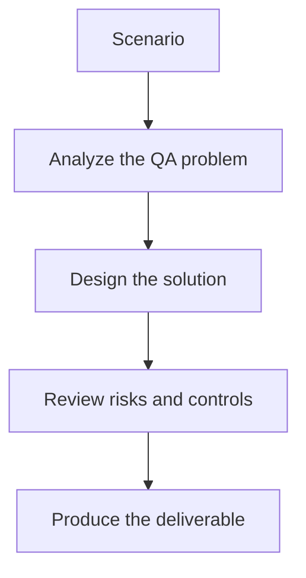

# Exercise 03: Validate Entity and Relationship Extraction

## Objective

Define QA checks for turning documents into graph data.

## Scenario

The ingestion pipeline uses an LLM to extract entities from requirements, bugs, and test cases.

## Tasks

1. List the extraction errors that would damage trust most.
2. Define a review sample strategy for extracted entities.
3. Create acceptance criteria for relationship quality.
4. Explain how you would monitor graph quality after ingestion.

## QA Checkpoints

- Graph entities reflect the QA domain accurately.
- Multi-hop value is explicit.
- Ingestion quality is testable.
- Graph answers remain explainable.

## Suggested Flow

## Expected Deliverable

A validation checklist for graph ingestion quality.
