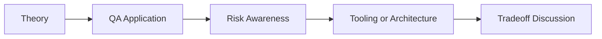

# Graph RAG QA Knowledge Base: QA/SDET Interview Questions

## How to Use This Folder

These questions are designed for QA engineers, SDETs, and AI-focused testing roles. Use them for self-review, mock interviews, or classroom discussion.

### Interview Questions
1. What problem does Graph RAG solve that standard vector RAG cannot?
2. How would you model QA assets such as bugs, modules, and tests in Neo4j?
3. What is multi-hop reasoning, and why is it valuable in change-impact analysis?
4. How would you validate the correctness of entity and relationship extraction?
5. When would you combine graph retrieval with vector search?
6. How would you explain Graph RAG to a senior QA engineer without graph-database experience?

## Competency Map

## Strong Answer Signals

- clear explanation of the underlying concept
- strong QA framing, not just generic AI wording
- awareness of failure modes, limits, and review practices
- ability to connect tools to delivery impact and maintainability

## Discussion Guide

After you attempt the questions on your own, review the expected discussion points here:

- [answers.md](./answers.md)
