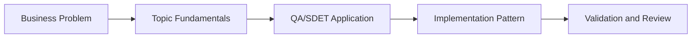

# Multi-Agent Test Orchestrator: Learning Guide

## What We Are Learning

Coordinating planner, generator, reviewer, executor, and reporter agents for end-to-end QA workflows.

### Learning Goals
- Understand how multi-agent systems break large QA tasks into specialized roles.
- Learn orchestration patterns such as supervisor routing, state tracking, and handoffs.
- Recognize the failure modes of multi-agent systems, including loops, drift, and state corruption.
- Map agent roles to actual QA delivery stages from planning to reporting.

### Core Concepts
- Planner, generator, reviewer, executor, and reporter roles
- LangGraph state transitions and orchestration control
- Shared context, tool access, and evidence handoff
- Observability and debugging for agent workflows

## QA/SDET Lens

- Focus on how this topic improves test design, reliability, coverage, or release confidence.
- Look for where AI should assist, where human review is mandatory, and how to measure trust.
- Tie every concept back to a concrete QA artifact such as a test case, report, dashboard, or pipeline gate.

## Concept Flow

## Suggested Study Sequence

1. Read the parent project README for the full project goal.
2. Learn the core concepts in this folder.
3. Try the exercises in `02_Exercises`.
4. Review the interview questions in `03_Interview_Questions`.
5. Return to the project implementation and map the concepts to code and deliverables.
