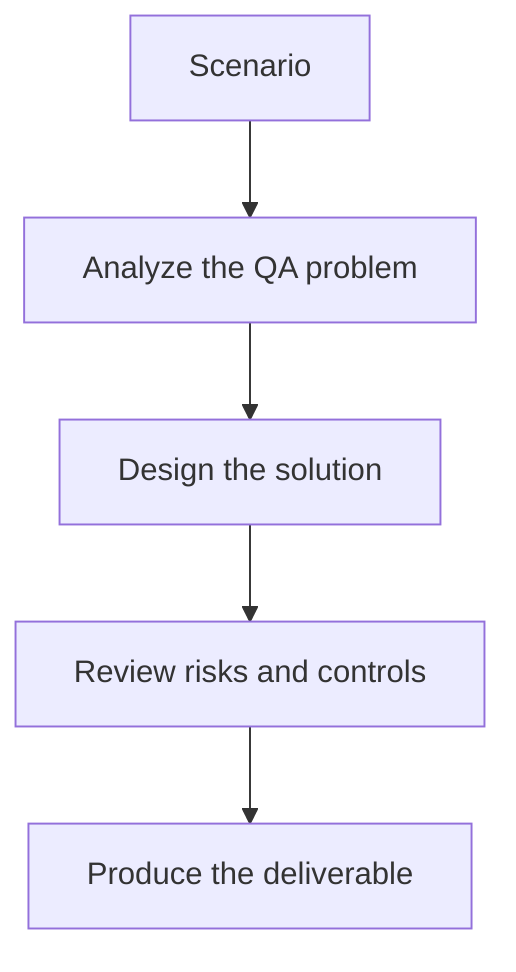

# Exercise 01: Define Agent Roles for a QA Workflow

## Objective

Break a full QA workflow into clean agent responsibilities.

## Scenario

A new feature needs planning, test generation, review, execution, and reporting in one orchestrated flow.

## Tasks

1. Assign responsibilities to planner, generator, reviewer, executor, and reporter agents.
2. Define the artifact each agent produces.
3. List one failure mode for each agent.
4. Explain how the supervisor should route or retry work.

## QA Checkpoints

- Roles are distinct and purposeful.
- State is explicit and bounded.
- Loop and retry behavior is controlled.
- Outputs stay observable across handoffs.

## Suggested Flow

## Expected Deliverable

A role matrix for a multi-agent QA workflow.
