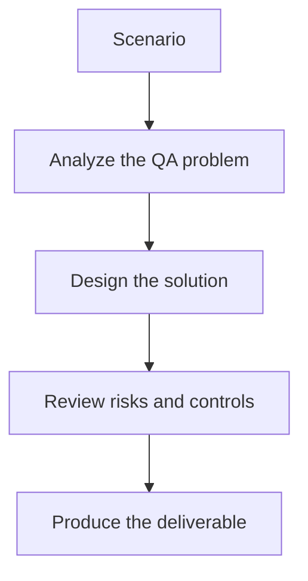

# Exercise 02: Design State and Handoffs

## Objective

Make agent coordination explicit and testable.

## Scenario

The reviewer agent may reject or request revision of generated test cases before execution.

## Tasks

1. Define the shared state fields required across handoffs.
2. Describe the contract between generator and reviewer.
3. Create routing rules for approval, revision, and escalation.
4. Explain how evidence returns from executor to reporter.

## QA Checkpoints

- Roles are distinct and purposeful.
- State is explicit and bounded.
- Loop and retry behavior is controlled.
- Outputs stay observable across handoffs.

## Suggested Flow

## Expected Deliverable

A state and handoff design for agent orchestration.
