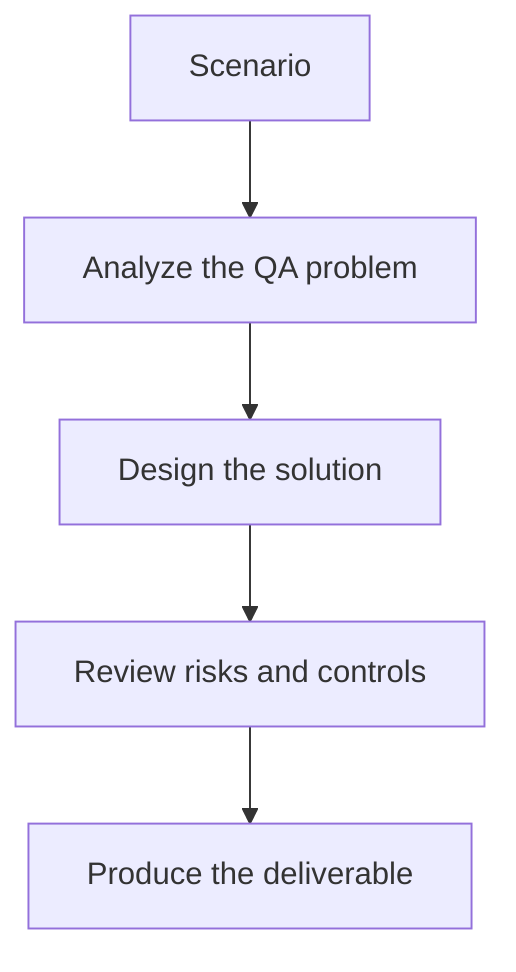

# Exercise 03: Debug a Stuck Orchestration

## Objective

Practice reasoning about failure modes in agent systems.

## Scenario

The workflow loops between reviewer and generator with no clear exit.

## Tasks

1. List the telemetry needed to diagnose the loop.
2. Propose a stop condition or retry limit.
3. Define when a human should intervene.
4. Explain how you would write a regression test for this failure mode.

## QA Checkpoints

- Roles are distinct and purposeful.
- State is explicit and bounded.
- Loop and retry behavior is controlled.
- Outputs stay observable across handoffs.

## Suggested Flow

## Expected Deliverable

A debugging runbook for multi-agent orchestration failures.
