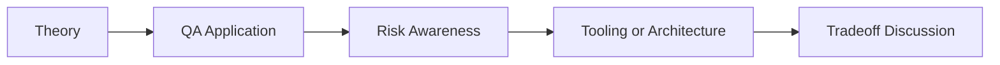

# Multi-Agent Test Orchestrator: QA/SDET Interview Questions

## How to Use This Folder

These questions are designed for QA engineers, SDETs, and AI-focused testing roles. Use them for self-review, mock interviews, or classroom discussion.

### Interview Questions
1. Why would a QA team use multiple agents instead of one larger agent?
2. How does a supervisor or router improve multi-agent QA workflows?
3. What shared state should be preserved between planner, generator, and executor agents?
4. How would you test a multi-agent workflow for loops or repeated failure states?
5. What evidence should the executor agent return to the reporter agent?
6. How would you explain LangGraph to an SDET who already understands test workflow state machines?

## Competency Map

## Strong Answer Signals

- clear explanation of the underlying concept
- strong QA framing, not just generic AI wording
- awareness of failure modes, limits, and review practices
- ability to connect tools to delivery impact and maintainability

## Discussion Guide

After you attempt the questions on your own, review the expected discussion points here:

- [answers.md](./answers.md)
