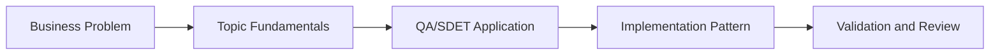

# LangChain Evaluation Pipeline: Learning Guide

## What We Are Learning

Continuous evaluation pipelines for RAG and LLM systems using metrics, golden datasets, and CI gates.

### Learning Goals
- Understand how to turn AI quality into repeatable regression checks.
- Learn the role of datasets, metrics, and dashboards in evaluation pipelines.
- Connect offline evaluation with CI/CD release decisions.
- Use QA thinking to separate signal from noise in automated AI evaluation.

### Core Concepts
- Golden datasets and benchmark versioning
- RAGAS, DeepEval, and custom score thresholds
- CI/CD integration for evaluation runs and drift alerts
- Dashboarding and trend analysis for model quality

## QA/SDET Lens

- Focus on how this topic improves test design, reliability, coverage, or release confidence.
- Look for where AI should assist, where human review is mandatory, and how to measure trust.
- Tie every concept back to a concrete QA artifact such as a test case, report, dashboard, or pipeline gate.

## Concept Flow

## Suggested Study Sequence

1. Read the parent project README for the full project goal.
2. Learn the core concepts in this folder.
3. Try the exercises in `02_Exercises`.
4. Review the interview questions in `03_Interview_Questions`.
5. Return to the project implementation and map the concepts to code and deliverables.
