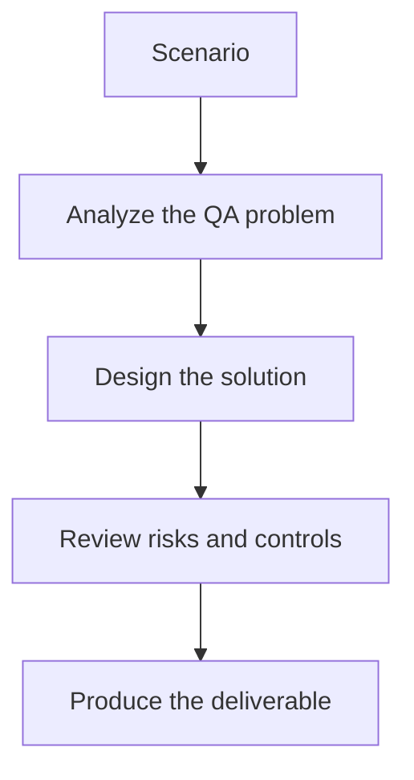

# Exercise 01: Build a Golden Dataset Plan

## Objective

Define a realistic evaluation dataset for an LLM or RAG system.

## Scenario

A knowledge assistant answers policy and troubleshooting questions for an internal support team.

## Tasks

1. Choose the prompt categories the dataset must include.
2. Define what makes an example high-value for regression testing.
3. Add one hard negative case and one ambiguity case.
4. Explain how the dataset should evolve after production incidents.

## QA Checkpoints

- Metrics reflect product risk.
- Datasets are versioned and explainable.
- CI gates are practical, not arbitrary.
- Regression triage distinguishes noise from real drift.

## Suggested Flow

## Expected Deliverable

A golden dataset plan with coverage categories.
