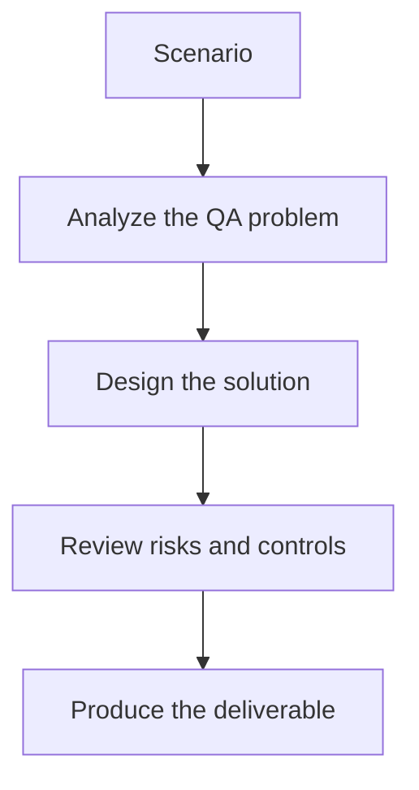

# Exercise 02: Define Evaluation Metrics and Gates

## Objective

Translate AI quality goals into measurable CI/CD criteria.

## Scenario

Your team wants to block deployments when answer quality drops significantly after a prompt change.

## Tasks

1. Choose the metrics that matter most for this assistant.
2. Set a threshold for each metric and justify it.
3. Explain what happens when one score is marginal and another is excellent.
4. Describe how humans review borderline evaluations.

## QA Checkpoints

- Metrics reflect product risk.
- Datasets are versioned and explainable.
- CI gates are practical, not arbitrary.
- Regression triage distinguishes noise from real drift.

## Suggested Flow

## Expected Deliverable

A metric and gating policy for CI evaluation runs.
