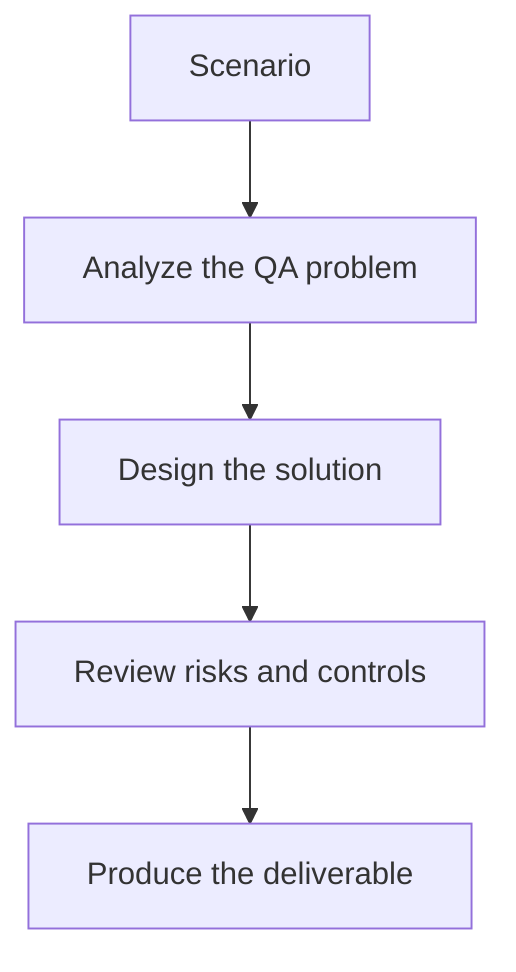

# Exercise 03: Investigate a Quality Regression

## Objective

Practice using evaluation signals to triage AI quality drift.

## Scenario

Faithfulness scores dropped after a retriever or prompt update, but stakeholder feedback is mixed.

## Tasks

1. List the likely causes of the regression.
2. Choose the artifacts and logs needed to investigate.
3. Define how you would separate real quality drift from evaluation noise.
4. Explain what change you would roll back first if needed.

## QA Checkpoints

- Metrics reflect product risk.
- Datasets are versioned and explainable.
- CI gates are practical, not arbitrary.
- Regression triage distinguishes noise from real drift.

## Suggested Flow

## Expected Deliverable

A regression triage plan for an AI evaluation pipeline.
