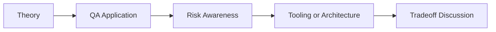

# LangChain Evaluation Pipeline: QA/SDET Interview Questions

## How to Use This Folder

These questions are designed for QA engineers, SDETs, and AI-focused testing roles. Use them for self-review, mock interviews, or classroom discussion.

### Interview Questions
1. Why should LLM or RAG systems have regression pipelines similar to software test suites?
2. What is a golden dataset, and how would you maintain it over time?
3. How would you choose thresholds for metrics such as faithfulness or relevancy?
4. What is the risk of relying on a single evaluation score in CI/CD?
5. How would you explain the role of RAGAS to a QA lead?
6. How would you investigate evaluation drift after a model upgrade?

## Competency Map

## Strong Answer Signals

- clear explanation of the underlying concept
- strong QA framing, not just generic AI wording
- awareness of failure modes, limits, and review practices
- ability to connect tools to delivery impact and maintainability

## Discussion Guide

After you attempt the questions on your own, review the expected discussion points here:

- [answers.md](./answers.md)
