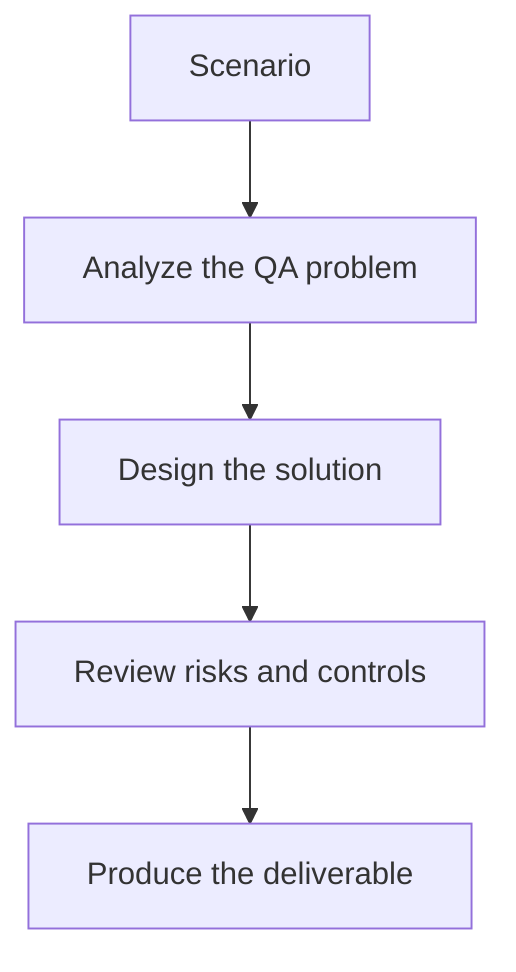

# Exercise 01: Generate Data from an API Schema

## Objective

Use schema information to design meaningful, valid test data.

## Scenario

A registration API needs valid, invalid, and boundary-case payloads for regression testing.

## Tasks

1. List the fields and constraints that matter most.
2. Design three valid personas and three invalid payload patterns.
3. Explain how generated data should remain reproducible for test reruns.
4. Add one privacy-safe rule for realistic synthetic data.

## QA Checkpoints

- Generated data respects constraints.
- Edge cases map to real risks.
- Synthetic data is privacy-safe.
- Data remains reproducible and reviewable.

## Suggested Flow

## Expected Deliverable

A schema-driven data generation matrix.
