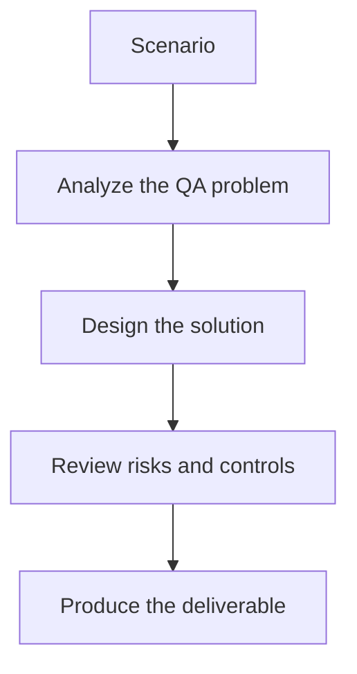

# Exercise 02: Plan Database-Aware Test Data

## Objective

Think through referential integrity and business rules before generation.

## Scenario

A commerce database includes customers, orders, products, and payment records.

## Tasks

1. Identify the foreign-key relationships that generated data must respect.
2. Choose one edge case for each major table.
3. Explain how you would create data for both happy and failure paths.
4. Define checks that catch inconsistent cross-table records.

## QA Checkpoints

- Generated data respects constraints.
- Edge cases map to real risks.
- Synthetic data is privacy-safe.
- Data remains reproducible and reviewable.

## Suggested Flow

## Expected Deliverable

A relational test-data design note.
