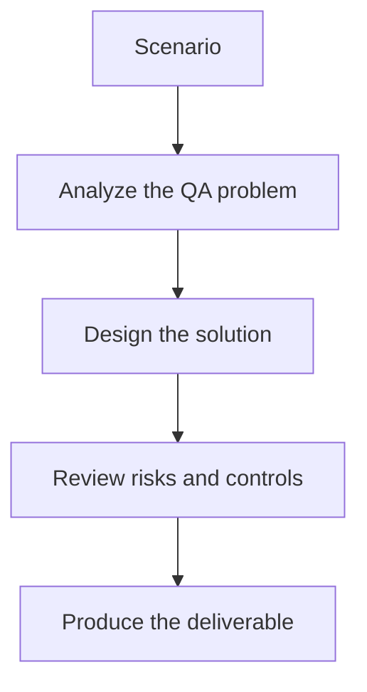

# Exercise 03: Review AI-Generated Edge Cases

## Objective

Evaluate whether AI-generated edge cases are useful or just random noise.

## Scenario

An LLM proposes Unicode-heavy names, malformed emails, and special-character addresses for a user profile form.

## Tasks

1. Separate useful edge cases from unrealistic ones.
2. Map each case to a product risk or validation rule.
3. List which cases should run in smoke, regression, or negative-only suites.
4. Explain how you would maintain an edge-case library over time.

## QA Checkpoints

- Generated data respects constraints.
- Edge cases map to real risks.
- Synthetic data is privacy-safe.
- Data remains reproducible and reviewable.

## Suggested Flow

## Expected Deliverable

A curated edge-case catalog with suite recommendations.
