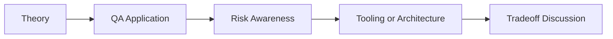

# AI Test Data Generation: QA/SDET Interview Questions

## How to Use This Folder

These questions are designed for QA engineers, SDETs, and AI-focused testing roles. Use them for self-review, mock interviews, or classroom discussion.

### Interview Questions
1. Why is AI useful for test data generation beyond static factories or Faker?
2. How would you keep generated data consistent with database constraints?
3. What privacy risks exist when generating data from production-like examples?
4. How would you generate edge-case data for an OpenAPI schema?
5. Why should QA teams validate AI-generated data before using it in regression runs?
6. How would you explain relational consistency in synthetic data generation?

## Competency Map

## Strong Answer Signals

- clear explanation of the underlying concept
- strong QA framing, not just generic AI wording
- awareness of failure modes, limits, and review practices
- ability to connect tools to delivery impact and maintainability

## Discussion Guide

After you attempt the questions on your own, review the expected discussion points here:

- [answers.md](./answers.md)
