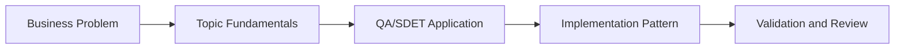

# AI Visual Regression Testing: Learning Guide

## What We Are Learning

Using multimodal AI to interpret screenshot changes, classify severity, and reduce false-positive visual diffs.

### Learning Goals
- Understand why pixel-perfect diffing creates noise in UI testing.
- Learn how AI vision models can reason about layout and content changes.
- Design severity rules for cosmetic, moderate, and critical visual changes.
- Connect visual analysis to accessibility and release risk.

### Core Concepts
- Baseline capture and current-run screenshot strategy
- Vision-model prompting for UI comparison
- Severity classification and false-positive reduction
- Accessibility-aware visual validation

## QA/SDET Lens

- Focus on how this topic improves test design, reliability, coverage, or release confidence.
- Look for where AI should assist, where human review is mandatory, and how to measure trust.
- Tie every concept back to a concrete QA artifact such as a test case, report, dashboard, or pipeline gate.

## Concept Flow

## Suggested Study Sequence

1. Read the parent project README for the full project goal.
2. Learn the core concepts in this folder.
3. Try the exercises in `02_Exercises`.
4. Review the interview questions in `03_Interview_Questions`.
5. Return to the project implementation and map the concepts to code and deliverables.
