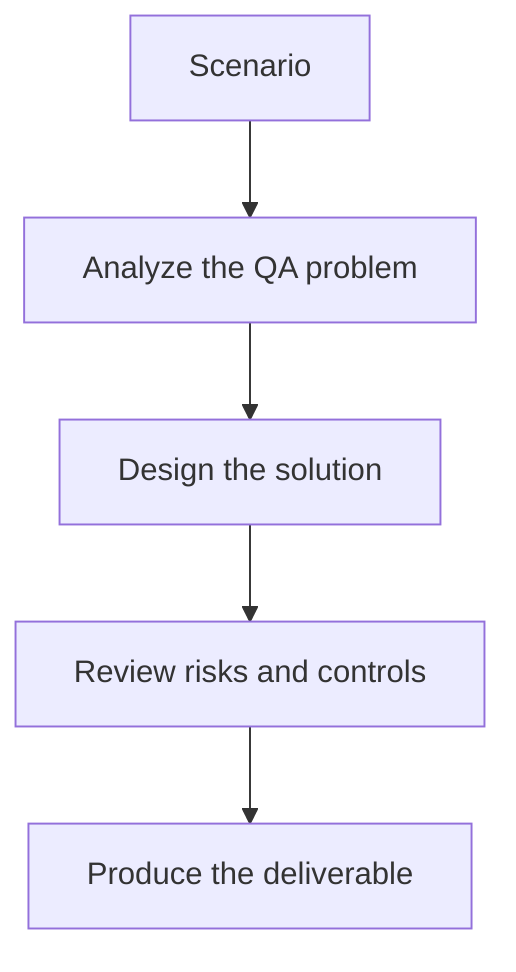

# Exercise 01: Create a Screenshot Strategy

## Objective

Plan a capture approach that produces stable, reviewable visual evidence.

## Scenario

A responsive web app needs visual checks across checkout, search, and account flows.

## Tasks

1. Choose pages, states, and viewports for baseline capture.
2. List the dynamic elements that should be stabilized or masked.
3. Explain how often baselines should be updated.
4. Define naming and storage rules for screenshots.

## QA Checkpoints

- Screenshot baselines are stable.
- Vision prompts are explicit about severity.
- Accessibility impact is considered.
- AI verdicts are reviewable, not blindly trusted.

## Suggested Flow

## Expected Deliverable

A screenshot strategy for visual regression testing.
