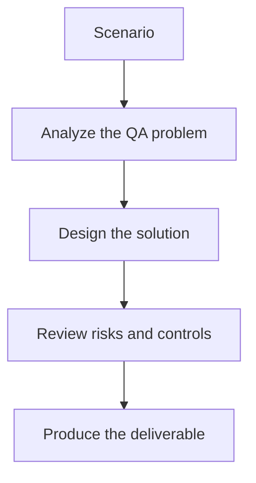

# Exercise 02: Write a Vision Comparison Prompt

## Objective

Use a multimodal model to reason about meaningful UI differences.

## Scenario

A current screenshot differs from baseline in spacing, button placement, and text color.

## Tasks

1. Write instructions that ask the model to compare baseline and current intentfully.
2. Define severity levels the model must use.
3. Tell the model what minor rendering differences to ignore.
4. Explain how the output should be structured for automation.

## QA Checkpoints

- Screenshot baselines are stable.
- Vision prompts are explicit about severity.
- Accessibility impact is considered.
- AI verdicts are reviewable, not blindly trusted.

## Suggested Flow

## Expected Deliverable

A multimodal prompt for visual diff analysis.
