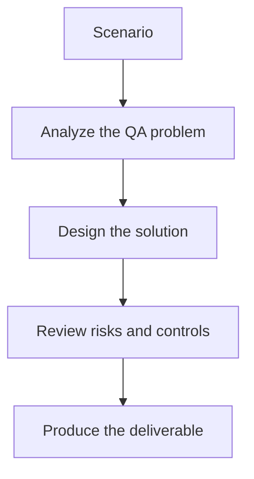

# Exercise 03: Review Accessibility and Severity

## Objective

Connect visual changes to user impact and release risk.

## Scenario

A new UI release changes contrast, spacing, and error-message prominence.

## Tasks

1. Classify which changes are cosmetic versus user-impacting.
2. Add one accessibility check for text contrast or readability.
3. Define the escalation path for critical visual regressions.
4. Explain how humans validate the model verdict before release.

## QA Checkpoints

- Screenshot baselines are stable.
- Vision prompts are explicit about severity.
- Accessibility impact is considered.
- AI verdicts are reviewable, not blindly trusted.

## Suggested Flow

## Expected Deliverable

A severity and accessibility review guide.
