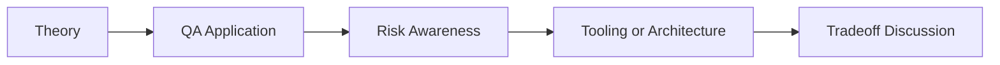

# AI Visual Regression Testing: QA/SDET Interview Questions

## How to Use This Folder

These questions are designed for QA engineers, SDETs, and AI-focused testing roles. Use them for self-review, mock interviews, or classroom discussion.

### Interview Questions
1. Why do traditional image diffs often fail in real QA pipelines?
2. How can multimodal AI reduce visual regression false positives?
3. What information should be included when sending screenshots to a vision model?
4. How would you distinguish a cosmetic layout change from a release blocker?
5. How would you test the consistency of AI-generated visual verdicts?
6. Why should accessibility considerations be part of visual regression analysis?

## Competency Map

## Strong Answer Signals

- clear explanation of the underlying concept
- strong QA framing, not just generic AI wording
- awareness of failure modes, limits, and review practices
- ability to connect tools to delivery impact and maintainability

## Discussion Guide

After you attempt the questions on your own, review the expected discussion points here:

- [answers.md](./answers.md)
