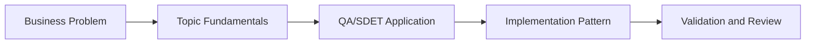

# AI-Assisted API Contract Testing: Learning Guide

## What We Are Learning

Using AI to generate, validate, compare, and monitor API contracts and breaking changes.

### Learning Goals
- Understand the role of API contracts in stable service integration.
- Learn how AI can assist with spec generation, drift detection, and change analysis.
- Differentiate breaking versus non-breaking changes in API evolution.
- Map contract quality checks to CI/CD and consumer confidence.

### Core Concepts
- OpenAPI and Pact-style contract thinking
- Drift detection between spec and implementation
- Breaking-change classification and migration impact
- Spec-driven testing with Schemathesis and mock servers

## QA/SDET Lens

- Focus on how this topic improves test design, reliability, coverage, or release confidence.
- Look for where AI should assist, where human review is mandatory, and how to measure trust.
- Tie every concept back to a concrete QA artifact such as a test case, report, dashboard, or pipeline gate.

## Concept Flow

## Suggested Study Sequence

1. Read the parent project README for the full project goal.
2. Learn the core concepts in this folder.
3. Try the exercises in `02_Exercises`.
4. Review the interview questions in `03_Interview_Questions`.
5. Return to the project implementation and map the concepts to code and deliverables.
