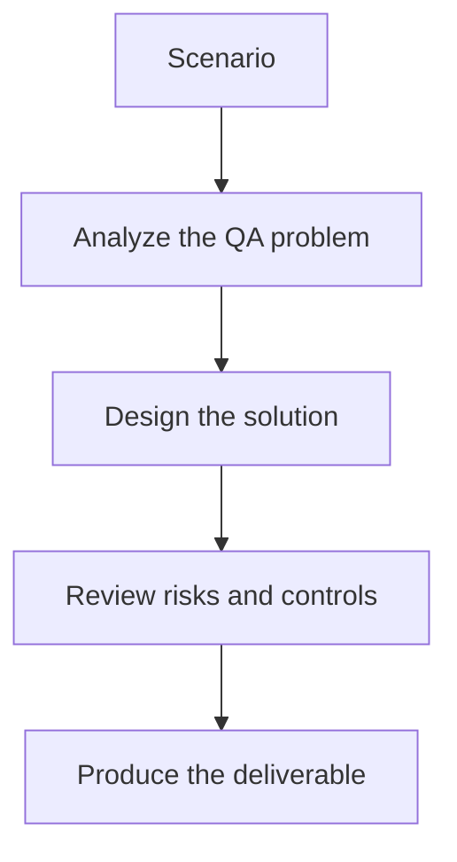

# Exercise 01: Draft a Contract Validation Plan

## Objective

Turn API expectations into a contract-checking strategy.

## Scenario

A provider service exposes order endpoints used by a web app and a mobile app.

## Tasks

1. Identify the critical request and response fields that consumers rely on.
2. Define one breaking and one non-breaking change example.
3. List the contract checks that should run in CI.
4. Explain how the results are shared with provider and consumer teams.

## QA Checkpoints

- Breaking changes are identified clearly.
- Spec and live behavior are compared with evidence.
- Consumer impact is part of severity.
- Generated tests remain contract-grounded.

## Suggested Flow

## Expected Deliverable

A contract validation plan with CI checkpoints.
